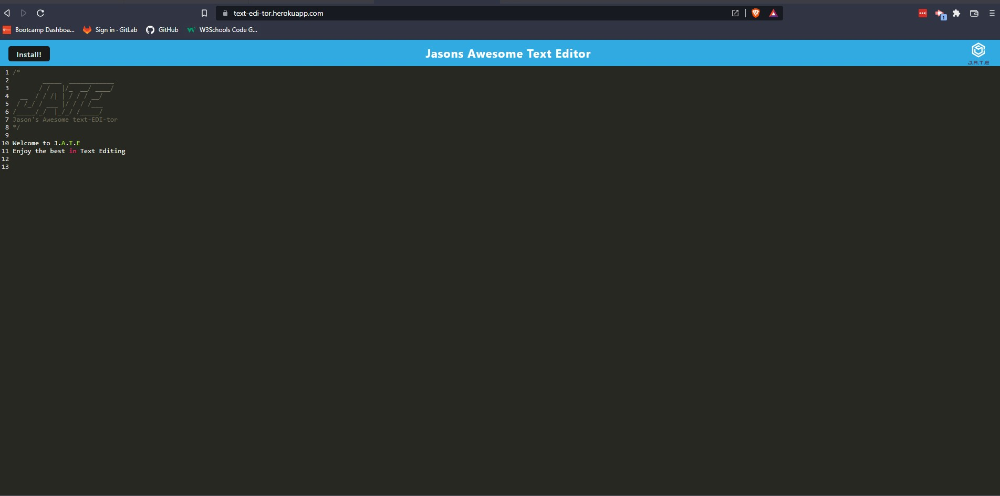

  <h1 align="center">J.A.T.E - Jason's Awesome Text Editor<h1>

  

  ## TABLE OF CONTENTS
  - [Description](#description)
  - [Installation](#Installation)
  - [Usage](#Usage)
  - [Tests](#Tests)
  - [License](#License)
  - [Credits](#Credits)
  - [Questions](#Questions)

  ## DESCRIPTION
  This Progressive Web application is the best Text editing tool you'll use. As a PWA you're able to download and install the web app and run it offline for when you don't have access to the internet and all data will still be saved until you come back online.

  ## APPLICATION DEPLOYED LINK
  [J.A.T.E Deployed](https://text-edi-tor.herokuapp.com/)
  
  ## INSTALLATION
  1. Install NodeJS here: [Download NodeJS](https://nodejs.org/en/download/)
  2. To install the required NPM packages to run the backend functionality, Type `npm install` in the command line to install associated npm packages and node modules to be able to run express, and dayJs for the middleware.

  ## USAGE
  * To run this node application, type `npm run dev` for running the application with nodemon for dev usage, or type `npm run start` to run normally to start the server.

  ## MEDIA
  #### J.A.T.E in Browser
  
   
  #### J.A.T.E as PWA
  

  ## Tests
  * To test the routes, [Download and install Insomnia](https://insomnia.rest/download)
  * Setup test routes as per the walkthrough video
  
  ## LICENSE
  Project developed 2022 by Jason Steer, 
  This application is licensed under the Apache 2.0 license.

  ## CREDITS
  - University of Sydney Coding Bootcamp - Mini Project 

  ## QUESTIONS
  For any questions on this project please contact me via my Github link or email. 

  **Find me on GitHub - UserName:** [eljsteer](https://github.com/eljsteer) 
  **Email me with any questions:** el.jsteer@gmail.com 
   
  
  _This README was generated with ❤️ by [LA-README-ZY](https://github.com/eljsteer/LA-README-ZY)_